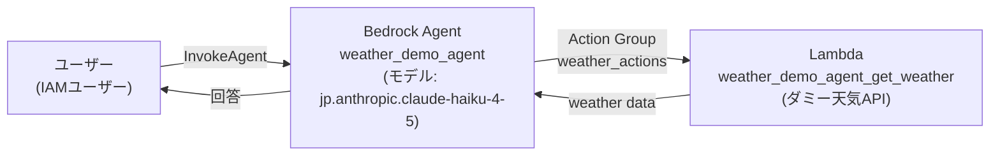
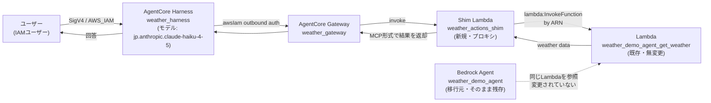

# AgentCore Harnessへの移行プラン

`weather_demo_agent`(Bedrock Agents クラシック)を **Bedrock AgentCore Harness** へ移行する際の
アセスメント結果と実施計画です。[aws/agent-toolkit-for-aws](https://github.com/aws/agent-toolkit-for-aws)
の `amazon-bedrock` スキルにある移行ガイド(`migrate-bedrock-agents-to-agentcore-harness.md`)の
フェーズ構成に沿って進めています。

> 元のAgent自体は変更・削除しません。移行は新しいリソース一式を追加で作成するだけです。

## アーキテクチャ図

### 移行前:Bedrock Agents クラシック



### 移行後:AgentCore Harness



移行後も元の `weather_demo_agent` と `weather_demo_agent_get_weather` Lambdaはそのまま残ります。
新しく追加されるのは **Harness・Gateway・Shim Lambda** の3つで、Shimが既存Lambdaを
ARN経由で呼び出す形になるため、天気データの実体(ダミーデータ)は1箇所のまま共有されます。

## Shim Lambdaとは

**Shim Lambda(`weather_actions_shim`)は、新規に作成する変換アダプター役のLambda関数です。**
`aws lambda create-function` で手動作成するのではなく、`agentcore.json` にコード定義を
書いておくことで、`agentcore deploy` 実行時にCloudFormation経由で自動的にビルド・デプロイされる、
**AWS上に実体を持つ通常のLambdaリソース**です。

**なぜ必要か。** Bedrock Agents(クラシック)のAction Group Lambdaと、AgentCore Gatewayとでは
呼び出し時のイベント形式(JSON構造)が異なります。

| | 元のLambdaが期待する形 | AgentCore Gatewayが実際に渡す形 |
|---|---|---|
| 呼び出し方 | Bedrock独自の封筒形式(`messageVersion`, `actionGroup`, `function`, `parameters`など) | ツールの引数がフラットな`event`、ツール名は`context.client_context.custom`内 |
| 応答形式 | `response.functionResponse.responseBody.TEXT.body` のようなネスト構造 | プレーンなJSON |

元のLambdaコードをそのままGatewayの背後に置いても、イベント形式が合わず動作しません。

**Shimがやっていること。**

```
Gateway → Shim Lambda(新規) → 元のLambda(既存・無変更) → Shim Lambda → Gateway
```

1. Gateway形式のイベントを受け取る
2. Bedrock Agents形式の封筒(`{"function": "get_weather", "parameters": [{"name": "location", "value": "tokyo", ...}]}`)に変換
3. 元のLambda(`weather_demo_agent_get_weather`)をARN指定でそのまま呼び出す(コードはコピー・改変しない)
4. 元のLambdaからのBedrock形式レスポンスを、Gatewayが期待するプレーンJSONに戻して返す

**なぜ元のLambdaを直接編集しないか。** 元のLambdaを直接書き換えると応答の形が変わり、
移行元のクラシックAgent(`weather_demo_agent`)側が壊れるリスクがあります。間に薄い変換層を
挟むことで、元のAgentとLambdaを一切変更せずに残し、移行後も両方を並行稼働させられます。

## 移行元の構成(Phase 2 ディスカバリー)

| 項目 | 内容 |
|---|---|
| Agent名 / ID | `weather_demo_agent` / `VFWU4H3N4Y`(version 2) |
| モデル | `jp.anthropic.claude-haiku-4-5-20251001-v1:0` |
| Action Groups | `weather_actions`(function-definition型、Lambda: `weather_demo_agent_get_weather`、関数: `get_weather`) |
| Knowledge Bases | なし |
| Guardrail | なし |
| Memory | なし |
| Multi-agent collaboration | `DISABLED` |
| Orchestration | `DEFAULT`(カスタムオーケストレーションなし) |
| `idleSessionTTLInSeconds` | 600秒 |
| 呼び出し可能な主体 | IAMユーザーのみ(リソースベースポリシーなし) |

## 適格性ゲート(Phase 3)

| 条件 | 判定 |
|---|---|
| マルチモーダル入力 | ✅ クリア(テキストのみ) |
| マルチエージェント協調 | ✅ クリア(`DISABLED`) |
| 到達不能なKnowledge Base | ✅ クリア(該当なし) |
| カスタムオーケストレーション | ✅ クリア(`DEFAULT`) |

ハードストップ条件なし。移行可能。

## 移行アセスメント台帳(Phase 4)

| コンポーネント | 分類 | 詳細 |
|---|---|---|
| モデル | 🟢 clean | `--model-id`で同一モデルをそのまま指定 |
| Instruction | 🟢 clean | prompt overrideはDEFAULT(カスタムなし)なので、そのまま`--system-prompt`へ |
| Action Group `weather_actions` | 🟢 clean | Shim Lambda経由でGateway target化。元Lambdaは変更しない |
| `idleSessionTTLInSeconds`(600秒) | 🟢 clean | `--idle-timeout 600`で再現 |
| Memory | 🟢 clean(該当なし) | 元Agent・Harnessデフォルトともにメモリ無効で状態一致 |
| Guardrail / Multi-agent / Return-of-Control | 🟢 該当なし | いずれも未使用 |

**劣化(degraded)・移行不可(cannot)項目はなし。**

補足: 元Agentのオーケストレーションプロンプトには`thinking`(拡張思考)設定が含まれるが、
`agentcore add harness`に対応する専用フラグは見当たらない。デモとしては影響軽微。

## マッピング(Phase 5)

| 元 | 移行先 |
|---|---|
| `weather_demo_agent`のモデル呼び出し | Harness `weather_harness`(同一モデルID) |
| Instruction | `--system-prompt` |
| Action Group `weather_actions`(`get_weather`, Lambda実行) | Gateway target(Shim Lambda経由で既存Lambdaをそのままarn呼び出し) |
| `idleSessionTTLInSeconds: 600` | `--idle-timeout 600` |
| IAM限定の呼び出し | `--authorizer-type AWS_IAM`(緩めずに同等維持) |
| メモリ未設定 | Harnessもデフォルトのメモリ無効のまま |

## 実施ステップ(Phase 6)

1. **Scaffold**: `agentcore create` でプロジェクト作成 → 生成されたディレクトリへ`cd`し、以降の全コマンドをそこで実行
2. **リージョン修正(重要)**: `agentcore/aws-targets.json` のデプロイ先リージョンを `ap-northeast-1` に手動修正
   (CLIのデフォルトは別リージョンになりがちで、ShimがソースのLambda ARNを呼べなくなる既知の罠)
3. **Shim Lambda作成**: `assets/lambda_shim.py.tmpl` を元に `tools/weather_actions_shim/handler.py` を作成
   (`ORIGINAL_LAMBDA_ARN`に既存Lambdaを埋め込み。元Lambdaには一切触れない)
4. **`agentcore.json`を手動編集**してGateway targetを追加(`get_weather`のツール定義をそのまま複製)
5. `agentcore add gateway --name weather_gateway --protocol-type MCP --authorizer-type AWS_IAM`
6. `agentcore add harness --name weather_harness --model-provider bedrock --model-id jp.anthropic.claude-haiku-4-5-20251001-v1:0 --system-prompt "<instruction>" --idle-timeout 600 --authorizer-type AWS_IAM`
7. `agentcore validate`(`Valid`と表示されることを確認)
8. **1回目のdeploy**: `agentcore deploy`(Gateway・Shim Lambda・Harnessを作成)
9. 初回のShim呼び出しは`AccessDenied`になる見込み — その時点でビルダー自身(移行プロセスではない)が
   元Lambdaに以下のような権限付与コマンドを実行する:
   ```bash
   aws lambda add-permission --function-name weather_demo_agent_get_weather \
     --statement-id agentcore-shim-invoke --action lambda:InvokeFunction \
     --principal <shim-role-arn> --source-arn <shim-lambda-arn>
   ```
10. `agentcore add tool --harness weather_harness --type agentcore_gateway --gateway weather_gateway --outbound-auth awsIam`
11. **2回目のdeploy**: `agentcore deploy`
12. `agentcore status` で完了確認

## コストとリスク

- 元の `weather_demo_agent` は一切変更・削除されない
- 新たに課金対象になるもの: AgentCore Harness/Gateway(リクエスト・実行時間ベース)、Shim Lambda(実行回数ベース、ごく小額)、CloudWatch Logs
- テスト後は元Agentと合わせて両方をクリーンアップすることを推奨
